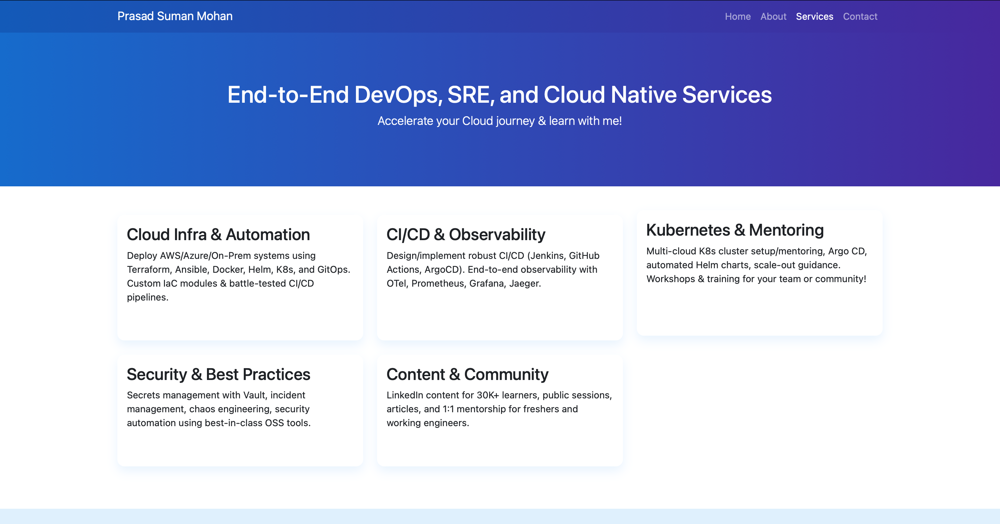
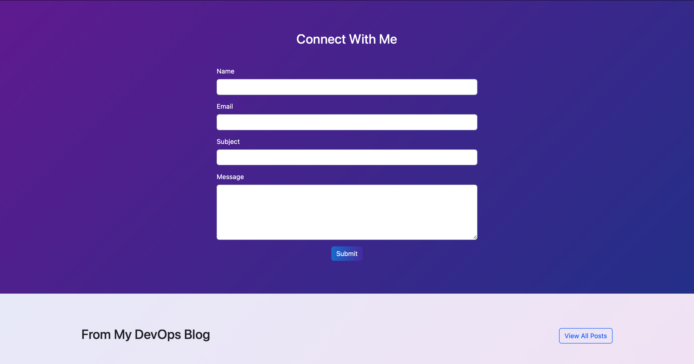

# Landing Website with Java Spring Boot


A simple landing website built with Java Spring Boot, featuring a responsive frontend using Bootstrap and Thymeleaf templating.

## Features

- Responsive landing page with modern design
- About page showcasing company information
- Services page highlighting offerings
- Contact form for user inquiries
- Docker support for easy deployment

## Requirements

- Java 11 or higher
- Maven 3.6 or higher
- Docker (optional, for containerization)

## Project Structure

```
├── src/
│   ├── main/
│   │   ├── java/
│   │   │   └── com/
│   │   │       └── example/
│   │   │           ├── controller/    # Web controllers
│   │   │           ├── model/         # Data models
│   │   │           └── Main.java      # Application entry point
│   │   └── resources/
│   │       ├── templates/             # Thymeleaf HTML templates
│   │       └── application.properties # Application configuration
├── Dockerfile                         # Docker configuration
├── pom.xml                            # Maven dependencies and build config
└── README.md                          # Project documentation
```

## Running the Application Locally

### Method 1: Using Maven

1. Clone the repository:
   ```
   git clone <repository-url>
   cd landing-website
   ```

2. Build and run the application using Maven:
   ```
   mvn clean install
   mvn spring-boot:run
   ```

3. Access the application at http://localhost:8080

### Method 2: Running the JAR file

1. Build the application:
   ```
   mvn clean package
   ```

2. Run the JAR file:
   ```
   java -jar target/landing-website-1.0-SNAPSHOT.jar
   ```

3. Access the application at http://localhost:8080

## Docker Deployment

### Building the Docker Image

Build the Docker image:

```
docker build -t landing-website .
```

### Running the Docker Container

Run the Docker container:

```
docker run -p 8080:8080 landing-website
```

Access the application at http://localhost:8080

## Deployment to Production

For production deployment:

1. Update application.properties with production settings
2. Build the Docker image:
   ```
   docker build -t landing-website:prod .
   ```

3. Push to your container registry:
   ```
   docker tag landing-website:prod your-registry/landing-website:prod
   docker push your-registry/landing-website:prod
   ```

4. Deploy to your production environment using Docker, Kubernetes, or your preferred platform

## Customization

- Modify the HTML templates in `src/main/resources/templates/` to change the website design
- Update the CSS styles within the HTML files
- Add new controller endpoints in `HomeController.java` for additional pages
- Extend the model classes for more complex data handling

## Live Website:

### Home:


### About:


### Services:


### Contact:


## License

[MIT License](LICENSE)